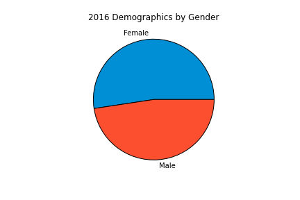
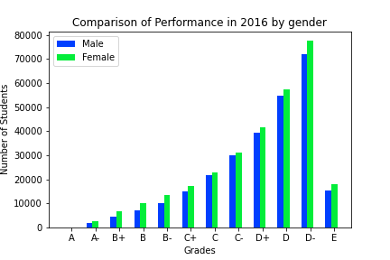
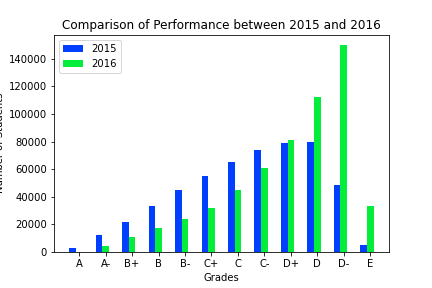
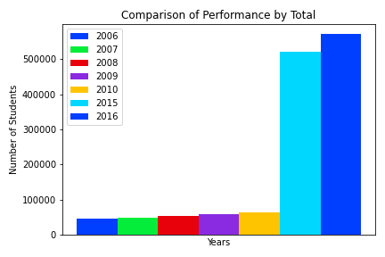

# KCSE 2016 RESULTS ANALYSIS REPORT
This report comprises the findings discovered during the analysis of the KCSE 2016 dataset. The data was analyzed using Python in a Jupyter Notebook file. In the analysis, I first sorted the data by gender in ascending order to simplify the process of deriving insights from the data. By resetting the data, I compared the data using three metrics, gender, total population, and the performance of the years 2015 and 2016. 

## Findings

### Gender

From the pie chart above, it can be observed that in 2016, there were female candidates who were more compared to their male counterparts. Additionally, the bar chart below illustrates that their performance was distributed evenly, with females being more in each grade cluster.

### Total Yearly Population

The bar chart above shows that between the years 2006 and 2010, there were few candidates compared to the years 2015 and 2016. The number of candidates in 2010 was merely 11.37% of the total number of candidates that took the exam in 2016.

### Comparison between 2015 and 2016 performance

From the chart above, it is evident that 2015 performance was better than that of 2016. Moreover, in 2016, most students scored D and D-minus, with fewer students scoring the coveted A and A-minus.
